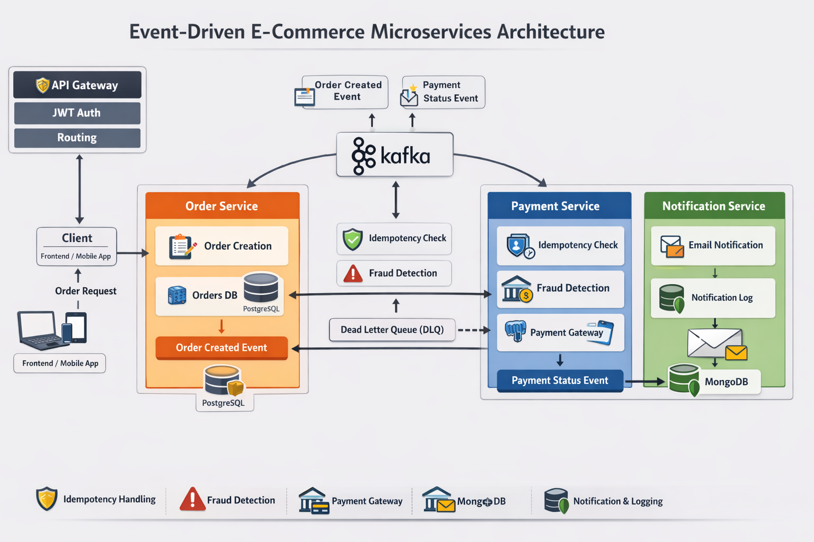

# Event-Driven E-Commerce Microservices System

## Overview

This project is a **production-style backend system** built using **Spring Boot microservices** and an **event-driven architecture**.

The goal of the project is to simulate a real-world **e-commerce backend workflow** where multiple independent services collaborate asynchronously to process orders, payments, and user notifications.

The system is designed with **scalability, fault tolerance, and loose coupling** in mind.

Key architectural concepts demonstrated:

* Microservices Architecture
* Event-Driven Communication
* Asynchronous Processing with Kafka
* Distributed System Design
* Fault Tolerance with Retry & Dead Letter Topics
* API Gateway and Centralized Authentication

---

## System Architecture

The system consists of multiple microservices communicating through **Kafka events**.



### Event Flow

1. Client creates an order via **Order Service**
2. Order Service publishes **OrderCreatedEvent**
3. **Payment Service** consumes the event and processes payment
4. Payment Service publishes **PaymentStatusEvent**
5. **Notification Service** consumes the event
6. Notification Service sends email notification and logs the event in MongoDB

This architecture ensures **services remain loosely coupled and independently scalable**.

---
Client
   |
API Gateway (JWT Authentication)
   |
------------------------------------------
|        |         |                     |
Auth     Order     Payment               Notification
Service  Service   Service               Service
   |                  |
   |                  |
   ------ Kafka Event Bus ------

## Microservices

### Order Service

Handles order creation and order lifecycle management.

Responsibilities:

* Create customer orders
* Persist order data
* Publish `OrderCreatedEvent` to Kafka

Tech stack:

* Spring Boot
* Spring Data JPA
* Kafka Producer
* REST APIs

---

### Payment Service

Processes order payments.

Responsibilities:

* Consume `OrderCreatedEvent`
* Process payment
* Publish `PaymentStatusEvent`

Features:

* Event-driven processing
* Retry handling
* Payment status publishing

Tech stack:

* Spring Boot
* Kafka Consumer & Producer
* Business logic layer

---

### Notification Service

Responsible for sending user notifications.

Responsibilities:

* Consume `PaymentStatusEvent`
* Send email notification
* Store notification logs

Tech stack:

* Spring Boot
* MongoDB
* Kafka Consumer
* SMTP Email Integration-Future

---

### Common Events Module

A shared library containing **event models used across services**.

Examples:

* `OrderCreatedEvent`
* `PaymentStatusEvent`

Benefits:

* Shared contract between services
* Prevents serialization issues
* Improves maintainability

---

## Technology Stack

Backend

* Java 17
* Spring Boot
* Spring Data JPA
* Spring Data MongoDB
* Spring Kafka

Messaging

* Apache Kafka
* Event-Driven Architecture

Database

* Relational Database (OrdersDB,PaymentDB,AuthDB)
* MongoDB (Notifications)

DevOps

* Docker
* Docker Compose
* GitHub

Security (Planned)

* Spring Security
* JWT Authentication
* API Gateway

---

## Key Engineering Concepts Demonstrated

### Event-Driven Microservices

Services communicate through **Kafka events rather than direct API calls**, enabling loose coupling.

### Asynchronous Processing

Kafka ensures **non-blocking workflows**, improving system responsiveness.

### Fault Tolerance

Retry mechanisms and **Dead Letter Topics (DLT)** prevent message loss during failures.

### Microservice Isolation

Each service:

* Has its own database
* Can be deployed independently
* Communicates via events

---

## Project Structure

```
microservices-project
│
├── api-gateway
│   ├── config
│   │     └── SecurityConfig.java
│   │
│   ├── filter
│   │     └── JwtAuthenticationFilter.java
│   │
│   ├── util
│   │     └── JwtUtil.java
│   │
│   ├── application.yml
│   │
│   └── ApiGatewayApplication.java
│
├── auth-service
│   ├── controller
│   ├── service
│   ├── repository
│   ├── entity
│   ├── security
│   │     ├── JwtUtil.java
│   │     └── SecurityConfig.java
│   └── AuthServiceApplication.java
│
├── order-service
│   ├── controller
│   ├── service
│   ├── repository
│   ├── entity
│   └── kafka-producer
│
├── payment-service
│   ├── consumer
│   ├── service
│   └── kafka-producer
│
├── notification-service
│   ├── consumer
│   ├── service
│   ├── repository
│   └── MongoDB integration
│
├── common-events
│   └── shared Kafka event classes
│
└── docker-compose.yml
```

---

## Running the Project Locally

### Prerequisites

* Java 17
* Docker
* Maven
* Kafka

### Steps

Clone the repository

```
git clone https://github.com/poojarajalakshmi1998-art//java-backend-project.git

```

Build services

```
mvn clean install
```

Start infrastructure using Docker

```
docker-compose up
```

Run services

```
mvn spring-boot:run
```

---

## Future Enhancements

Planned improvements for the system:

* Distributed tracing with Zipkin
* Centralized logging
* Kubernetes deployment
* CI/CD pipeline integration

---

## Why This Project

This project was created to demonstrate **backend architecture skills expected from modern Java backend engineers**, including:

* Microservices design
* Event-driven systems
* Messaging platforms
* Fault tolerant architecture
* Scalable service communication

---

## Author

Pooja S
Java Backend Developer

Skills:
Java • Spring Boot • Kafka • Microservices • SQL • MongoDB • Docker
